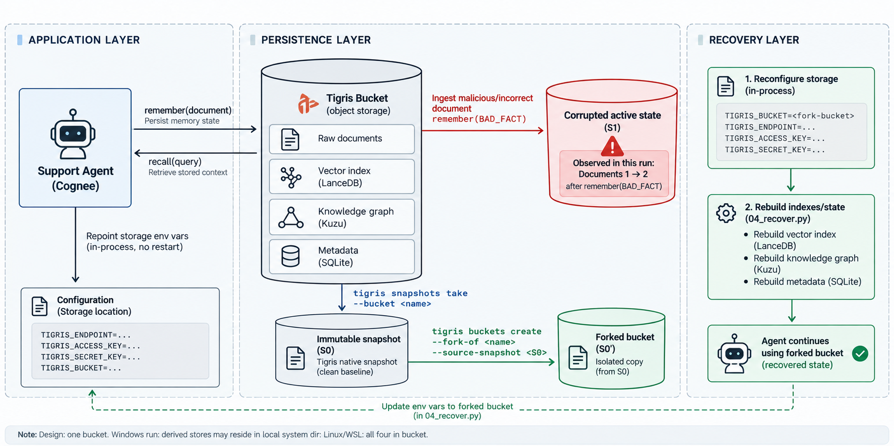

# Agent Memory That Survives Mistakes

Give an AI agent memory that can be corrupted, detected, and recovered, using
[Cognee](https://github.com/topoteretes/cognee) for the memory engine and
[Tigris](https://www.tigrisdata.com/) object storage for snapshot-and-fork recovery.

The whole point: an agent's memory (raw documents, vector index, knowledge graph, and
metadata) lives as files in **one Tigris bucket**. That makes recovery a single storage
operation, a fork from a known-good snapshot, instead of reconciling backups across four
separate stores or re-ingesting everything from scratch.



## What this demo does

1. **Ingest** a small support FAQ into Cognee memory, stored on Tigris.
2. **Snapshot** the clean memory as a recovery point.
3. **Corrupt** it on purpose by ingesting a contradictory fact.
4. **Detect** the corruption automatically, the agent audits its own memory and returns a
   `degraded` verdict.
5. **Recover** by forking the clean snapshot back, no re-ingestion from scratch.
6. **Self-heal** by composing detect + recover into one loop, so the agent fixes itself.

## Repository layout

```
.
├── data/
│   └── support_faq.md          # the knowledge base (edit this to use your own)
├── src/
│   ├── config.py               # loads and validates .env before cognee imports
│   ├── ingest.py               # remember(): builds graph + vector index on Tigris
│   ├── ask.py                  # recall(): grounded question answering
│   ├── corrupt.py              # injects a conflicting fact
│   ├── check.py                # self-audit: returns ok / degraded verdict
│   └── tigris.py               # thin subprocess wrapper around the Tigris CLI
├── scripts/
│   ├── 01_ingest.py            # build memory + reminder to snapshot
│   ├── 02_ask.py               # ask a question from the CLI
│   ├── 03_corrupt.py           # corrupt, then re-ask
│   ├── 04_recover.py           # manual recovery: fork a snapshot back
│   ├── 05_autoheal.py          # detect + auto-recover in one loop
│   └── 06_visualize.py         # render the knowledge graph (clean vs corrupt)
├── notebook.ipynb              # the full walkthrough, end to end
├── assets/
│   └── architecture.png
├── .env.example
└── requirements.txt
```

## Prerequisites

- Python 3.10+
- Node.js + npm (for the Tigris CLI)
- A [Tigris account](https://console.storage.dev/signup) and an access key pair (`tid_` / `tsec_`)
- An OpenAI API key

## Setup

Install the Tigris CLI and sign in:

```bash
npm install -g @tigrisdata/cli
tigris configure --access-key tid_YOUR_KEY --access-secret tsec_YOUR_SECRET
```

Create a bucket with snapshots enabled (this flag is required at creation and cannot be
added later):

```bash
tigris buckets create <your-bucket> --enable-snapshots
```

Install the Python dependencies:

```bash
pip install -r requirements.txt
```

Copy `.env.example` to `.env` and fill in your keys:

```bash
cp .env.example .env
```

```dotenv
AWS_ACCESS_KEY_ID=tid_YOUR_ACCESS_KEY_ID
AWS_SECRET_ACCESS_KEY=tsec_YOUR_SECRET_ACCESS_KEY
AWS_REGION=auto
AWS_ENDPOINT_URL=https://t3.storage.dev

LLM_API_KEY=sk-your-openai-api-key
LLM_MODEL=openai/gpt-4o-mini
EMBEDDING_MODEL=openai/text-embedding-3-small

STORAGE_BACKEND=s3
STORAGE_BUCKET_NAME=<your-bucket>
DATA_ROOT_DIRECTORY=s3://<your-bucket>/cognee/data
```

A few of these matter more than they look:

- **`STORAGE_BACKEND=s3`** is required, or Cognee writes to local disk even with the
  `s3://` paths set, and nothing lands in your bucket.
- **`EMBEDDING_MODEL`** is worth pinning up front. Ingest with one model and switch later,
  and Cognee rejects the dataset over an embedding-dimension mismatch.
- **`SYSTEM_ROOT_DIRECTORY`** is intentionally omitted. `config.py` derives a local path
  for it, since on Windows the embedded graph engine can't write to `s3://`. Raw data
  still goes to Tigris. On Linux or WSL you can set it to
  `s3://<your-bucket>/cognee/system` to run fully single-bucket.

## Run it

Set the Python path so `src/` is importable, then walk the flow:

```bash
# Linux / macOS
export PYTHONPATH=.
# Windows PowerShell
$env:PYTHONPATH = "."

python scripts/01_ingest.py                      # build clean memory
tigris snapshots take <your-bucket>              # baseline recovery point
python scripts/02_ask.py "What is your refund policy?"

python scripts/03_corrupt.py                     # inject a contradictory fact, re-ask
python src/check.py                              # verdict: degraded

python scripts/05_autoheal.py                    # detect + auto-recover in one step
```

Or open `notebook.ipynb` and run it top to bottom for the narrated version.

To render the knowledge graph before and after corruption:

```bash
python scripts/01_ingest.py
python scripts/06_visualize.py clean
python scripts/03_corrupt.py
python scripts/06_visualize.py corrupt
```

Each writes a self-contained HTML file to `graphs/` you can open and inspect.

## How recovery works

Recovery is a fork, not a re-ingestion. The Tigris fork restores the clean **raw data**
instantly from the snapshot; the **derived** memory (graph + vectors) is then rebuilt from
that recovered data. On Linux/WSL the rebuild reads straight from the fork's `s3://`
prefix; on Windows it reads from the local mirror of the same data. Either way, you never
reconstruct the knowledge base from scratch.

The mental model: a snapshot is a commit, a fork is a branch, and recovery is a checkout
of a known-good state.

## Notes and limits

- The file-based store is single-writer (last-writer-wins). It's safe for this demo's
  single agent process; for multiple concurrent writers, use Cognee's Postgres-backed mode
  for the metadata and graph and keep Tigris for the raw data and snapshots.
- A deleted bucket name isn't immediately reusable, so `05_autoheal.py` gives each recovery
  fork a unique timestamped name.
- The whole walkthrough sits inside the Tigris free tier; the only metered spend is a few
  cents of OpenAI usage.

## Cleanup

Delete forks first (a source can't be deleted while forks depend on it), then the source:

```bash
tigris buckets delete <fork-bucket> --yes
tigris buckets delete <your-bucket> --yes
```

## Resources

- [Tigris Cognee integration guide](https://www.tigrisdata.com/docs/agents/agent-cognee)
- [Bucket forking and snapshots](https://www.tigrisdata.com/docs/buckets/snapshots-and-forks/)
- [Tigris CLI reference](https://www.tigrisdata.com/docs/cli)
- [Cognee documentation](https://docs.cognee.ai/)

## License

MIT